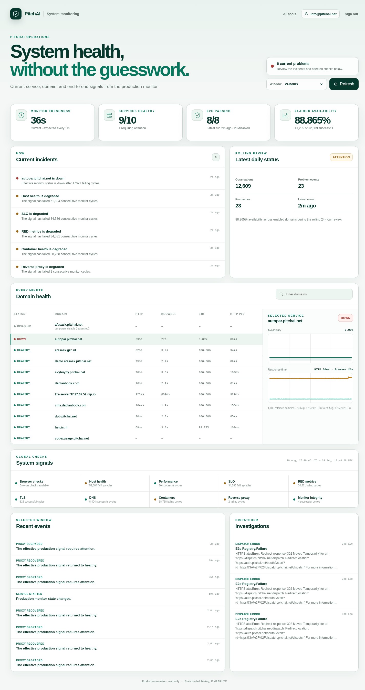
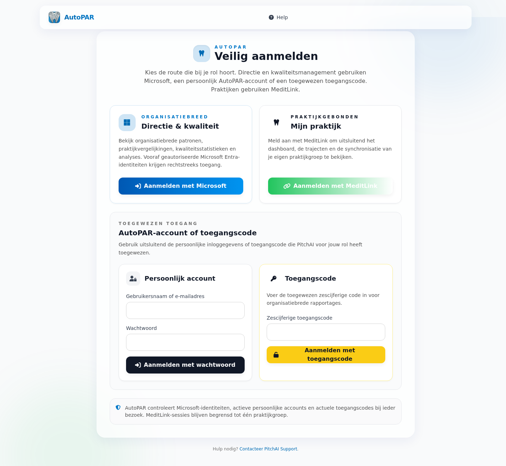

# AutoPAR false-down incident evidence — 2026-08-24

## Incident state before the fix

The production dashboard reported 9 of 10 enabled services healthy and marked
only `autopar.pitchai.net` down. AutoPAR showed a fail streak of 17,022 cycles
and 0 successful checks out of 1,401 in the rolling 24-hour window, even though
the monitor's independent `/health` contract was green.



The failed browser result consistently had a final HTTP status of 200 and a
final URL under `/login-page`. It failed because the configured title was
`AutoPAR Web App` and the check required `script#wss-connection`; the live page
title is `AutoPAR` and that implementation marker no longer exists.

## Independent AutoPAR verification

At 18:21 UTC, direct probes established the live contract:

- DNS A record: `37.27.67.52`; no AAAA record was returned.
- `GET https://autopar.pitchai.net/`: HTTP 302 with
  `Location: /login-page?next=/`.
- Redirect destination: HTTP 200, final URL
  `https://autopar.pitchai.net/login-page?next=/`, HTML content.
- Browser: title `AutoPAR`, visible token-login form at
  `form[action='/login-token'] input[name='token']`, and no
  `script#wss-connection` element.
- `GET /health`: HTTP 200, `application/json`, `status=healthy`, runtime config
  `2026-03-07.1+pgbouncer-autopar`.
- TLS hostname verification: valid for `autopar.pitchai.net`; Let's Encrypt YE1
  certificate valid from 2026-07-05 01:46:36 UTC through
  2026-10-03 01:46:35 UTC.



These checks show that AutoPAR itself was serving its intended protected-login
boundary and health endpoint. No AutoPAR mutation was made.

## Monitoring correction

The monitor now validates the canonical host, exact final path `/login-page`,
final HTTP 200, live title, stable token form, product text, and the independent
strict `/health` JSON contract. HTTP evidence includes a sanitized redirect
ledger. A wrong final auth path fails loudly.

The production-lineage image built from commit `85054a2` produced:

```text
domain: ok (reason=ok)
redirect: 302 https://autopar.pitchai.net
       -> 200 https://autopar.pitchai.net/login-page
browser: title=AutoPAR, final_path=/login-page, selector present
health:  200 application/json, status=healthy
synthetic token_login_landing: ok
```

Validation on that exact source state:

- deploy workflow Docker suite: 129 passed, 4 live-only skipped;
- focused HTTP, Playwright, and plugin-contract suite: 23 passed;
- changed runtime-file Ruff finding categories/count: identical to untouched
  production `main` (89 before, 89 after);
- pull request: [#33 — Fix false AutoPAR downtime signal](https://github.com/JoshuaSeth/pitchai-monitoring/pull/33).

## Evidence integrity

```text
bd00eafae53d2faaf469ecd1a56b5ea7c363d723b1251a5f195cb22bf309eb37  autopar-login-before.png
91c2f61e9c8d1e8334a3daf3e5d891bae13bbf8df926cefabf3c5155646d4dbf  monitoring-dashboard-before.png
```
