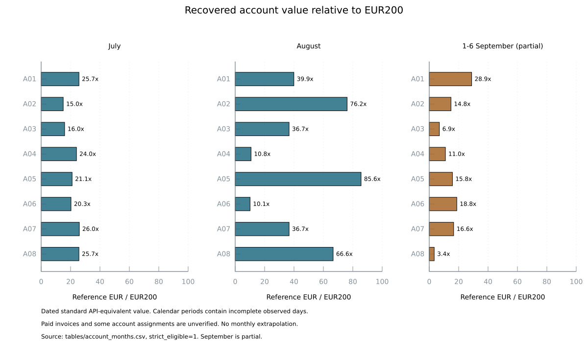
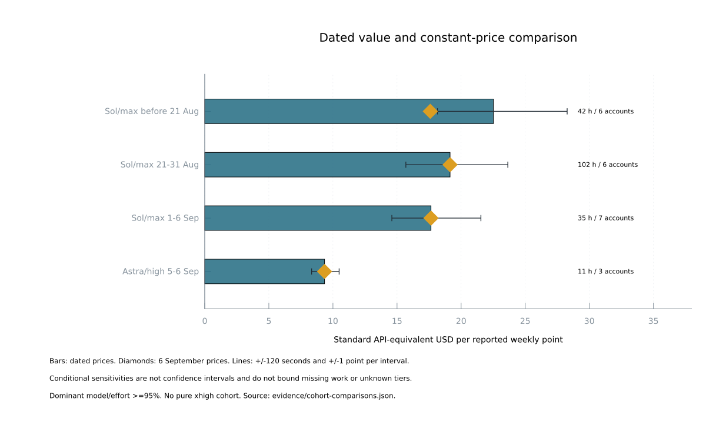
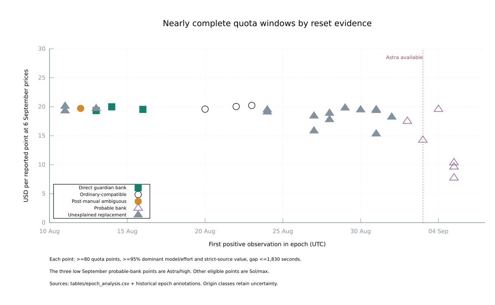

# Codex subscription capacity dossier

Evidence cutoff: **6 September 2026 at 20:20 UTC, exclusive**. Accounts use stable anonymous labels A01–A08. Raw workload dates span 5 November 2025–6 September 2026, while useful account quota history is concentrated in July–September 2026.

The account-month benchmark ranges from 15.0–26.0× EUR200 in July to 10.1–85.6× in August. Comparable hourly data links later Astra/high usage to lower API-equivalent value per reported quota point. August banked windows show similar constant-price value to ordinary-compatible windows, while a September-specific bank penalty remains unresolved.

## Sources and coverage

| Evidence family | Retained coverage and volume | What it establishes |
| --- | --- | --- |
| Rollout union | 23,705 discovered paths across main/monitoring, Jeff, historical main and FSN1. 20,152 readable, 3,529 missing, 24 inode aliases. 133,998,392,296 bytes scanned. | Timestamped token and model/effort fields, plus quota deadlines where recorded. A file or counter alone does not prove a distinct live request. |
| Historical main | 369 readable of 377 paths, 20.62 GB. | Older workload history. |
| Jeff | 789 readable of 1,134 paths, 17.11 GB. | Additional managed and copied history. |
| Main and monitoring | 18,992 readable of 22,192 paths, 96.28 GB. | Most recovered workload, including overlapping archives and runtime copies. |
| FSN1 | Two readable paths, six token events. | Bounded contribution from the fourth extraction cell. |
| Broker quota database | 40,936 extracted sample rows, 19 August–6 September. Nine backups add no missing quota tuples. | Account-tagged quota snapshots with freshness qualifications. |
| Reset guardian | 15,635 snapshots, 10 August–6 September. Twenty-seven credit references and six recorded successful redemptions. | Direct quota and bank inventory history. |
| Recovery logs | 7,246 unique account/probe quota rows across retained sources. Five-hour fields survive in 104 observations from 5–11 July. | Earlier account-tagged quota and some lease evidence. |
| Normalized quota union | 52,551 observations: 15,635 guardian, 17,701 current, 5,625 recovery, 597 last-known and 12,993 legacy/stale. | Explicit separation of fresh and historical/cached values. Counts differ from raw exports because duplicate provider observations collapse. |
| Manual reset responses | Ten original response records corroborate four actions on 12 July and 10 August. | Action results and delayed fresh quota state, with account/deadline attribution grades. |
| Lease history | 4,563 observations, 2,947 renewal states, 133 issuances. | Partial corroboration of account ownership. Renewal is not a new lease. |
| Historical reports | Related PM workpads, the August usage-history investigation, durable time-series implementation and September historical cost ledger. Telegram search screened 219 receipts and yielded 103 candidate lines. | Corroboration and source discovery. Narrative percentages remain outside the primary quota ledger. |
| Billing evidence | Twenty-four complete provider searches across six matched M365 mailboxes, 616 messages in range, seven provider notices. Fourteen iCloud folders and 28 searches yielded ten matches. | Scheduled nonrenewal dates and offers, but no matched paid subscription invoice amount. |
| Public sources | Official model/pricing pages, dated release changes, ECB daily exchange rates, original Reddit claim and linked author's table. | Reference prices and claims to test. |

The [source inventory](source_inventory.json) and extraction manifests record locations, cutoff rules, hashes and source-specific gaps.

### Earlier research reconciled

The August investigation reported 7,045 unique pre-17-August recovery observations. The surviving inputs reproduce **6,937** under its original account/probe/window/percentage/reset key. The 108-observation difference remains unrecovered after checking the surviving report, logs and artifact roots. The missing observations limit coverage and provide no evidence of a quota-policy change.

The September cost ledger contains 244,113 logical turns. Its 119,835 modern numeric turns permit a direct counter comparison. After replay correction, 104,505 match all four counters exactly, 108 have higher current totals, 51 have lower current totals, 15,072 prior zero-token turns have no current calls, and 99 nonzero prior turns are absent. All 99 map to 23 files recorded as unavailable. Exact matches include 689 turns flagged by the prior study, so agreement alone does not certify consumption. The earlier report repriced historical workload at comparison-model rates. Account values here use dated rates for the recorded model.

### Narrative timestamps

Historical Telegram receipts use a timestamp-without-time-zone column. The current write path uses the database's Europe/Berlin clock. Historical per-row session time zones are unrecorded. Comparing UTC and Berlin interpretations against nearby direct quota probes produces two exact matches under the Berlin interpretation and other one-point differences. The nearby probes support a local-time interpretation, with insufficient precision for the primary quota ledger. A July 26 report explicitly states that no reset was redeemed.

## Accounting, identity and comparison methods

### From cumulative counters to candidate calls

Each source is read in recorded order. Unchanged cumulative counters contribute no new usage. When counters change, the reported last-call tuple is retained and compared with the cumulative difference. Rollbacks, missing prior history and non-reconciling calls remain explicitly classified. Unrecovered increments remain unknown.

Cached input is included in total input. Reasoning output is included in total output. The disjoint workload components are therefore:

`uncached input = input − cached input`

`total workload tokens = uncached input + cached input + output`

The 7,319,366 token events yield 6,149,650 candidate source observations. Exact copied event identities collapse to 6,066,658 candidate calls. A second replay pass uses the turn identifier and all eight last/cumulative token counters across different source files. It requires session identity to be present but permits a fork to replace the session ID. Later cross-source copies are removed. Missing identifiers and same-source repetitions remain visible because identical token counts alone cannot prove a replay.

This pass removes 2,249,296 later copies, or 37.0764% of candidates, and 41.506% of standard reference value. Genuine repeated requests with distinct consumption evidence remain consumption. A transport retry message alone leaves the number of consumed requests unresolved. The residual audit of 1,693,319 strict survivors finds no full-counter coincidences across different nonmissing turns. Sixty-two missing-turn groups contain 163 calls, including 101 later records that are unpriced. They produce no additional dollar deduction.

### Account attribution and its limits

Positive, non-idle quota deadlines supply account fingerprints. The account-window audit finds 280 fingerprints with no shared or adjacent positive deadline across different accounts. Candidate joins use exact deadline matching or a separately graded one-second tolerance. There are 1,950,968 exact candidate joins, 47,082 tolerance joins, 3,518,429 candidates without a historical anchor, and 550,179 with a different limit identifier. These candidate counts precede replay and strict-source controls.

The stricter subset requires a matching outer session header, a timestamp after session creation, a recognized runtime path, reconciled last-call counters, consistent totals and no model/effort conflicts. It contains **1,693,319 calls with $151,117.94 of standard API-equivalent value**. These source checks do not independently attest to live execution or a verified paid subscription.

Lease evidence remains a separate check. Issue-to-latest-expiry ranges can overlap after renewal or early release and lack reliable capture times. Only 62,696 strict calls have one compatible account range, 4,623 have multiple compatible ranges, 190,876 fit ranges recorded only for other accounts, 1,407,823 have no range and 27,301 lack source affinity. The retained lease grades distinguish these cases. Account totals are conditional on the reset-fingerprint attribution.

### Concurrent workload and fixed-hour controls

An interval includes all recovered calls assigned to the account, including concurrent sessions. Its reported quota movement is counted once. Model rows share that account-level denominator. Model/effort dominance is measured by reference-value share, so a dominant-model label still permits up to 5% other workload value.

Candidate windows are fixed UTC hour bins selected independently of observed efficiency. Endpoints use fresh account-tagged provider readings with positive usage. Timing eligibility requires at most one second of reset spread, at least 30 minutes of span, no observation gap over 30 minutes, no step below −1 point and positive net movement. The first/last samples lie inside the hour, so an eligible interval need not last 60 minutes.

Of 3,382 candidate windows, 673 meet timing controls. Forty-four candidates are five-hour windows and none qualifies. Weekly windows produce 641 rows with recovered exposure, of which 192 meet the primary controls: at least five points, at least 95% dominant-model/effort value, at least 95% strict-source value, known supported prices and matching quota deadlines. Sensitivity partitions repeat the analysis at 80%, 90% and 95% dominance and two, five and ten points.

### Reset epochs and uncertainty

Positive weekly readings are segmented when the same account's deadline changes by more than 30 seconds. This tolerance handles probe jitter within an account and is never used for cross-account identity. An epoch's consumption interval runs from its first positive observation to its first observed maximum. Idle zero readings have floating deadlines and are excluded. The resulting 123 positive epochs describe recovered intervals. Their endpoints can cover only part of a quota week.

Nearly complete comparisons require at least 80 points, the same provenance/pricing/dominance controls, and no consumption observation gap over 1,830 seconds. Thirty extra seconds allow recorded probe jitter. Most selected epochs cover 99 points, so their dollar sums are observed 99-point values, without extrapolation to an unseen full allowance. [Historical annotations](evidence/epoch-transition-annotations.json) revise three quota-only transition labels.

For value `V` and observed quota change `Q`, the descriptive slope is `V/Q`. Timing sensitivities recalculate value inside endpoints inset by 120 seconds and enclosing endpoints extended by 120 seconds. For `n` intervals, rounding sensitivities divide those values by `Q + e×n` and `Q − e×n`, with `e` equal to one or two points. The upper expression is undefined if the denominator is nonpositive. These conditional sensitivity bounds vary endpoint timing and rounding assumptions. They have no statistical confidence level and leave unrecovered workload, unknown service tiers and hidden metering weights unbounded.

## Prices and account-period reference value

The primary numerator applies the actual recorded model's dated standard API rates to each call's uncached input, cached input and output. Output already includes reasoning tokens. Calls without a supported dated price stay unpriced. A separate comparison reprices the same calls at 6 September rates to separate price changes from workload/quota changes.

| Model and effective period | Uncached input / million | Cached input / million | Output / million |
| --- | ---: | ---: | ---: |
| GPT-5.5, from 24 April | $5 | $0.50 | $30 |
| Sol, 26 June–20 August | $5 | $0.50 | $30 |
| Sol, from 21 August | $4 | $0.40 | $20 |
| Terra, 26 June–29 July | $2.50 | $0.25 | $15 |
| Terra, from 30 July | $2 | $0.20 | $12 |
| Luna, 26 June–29 July | $1 | $0.10 | $6 |
| Luna, from 30 July | $0.20 | $0.02 | $1.20 |
| Astra, from 3 September | $10 | $1 | $50 |

The full dated model table is in [pricing.json](pricing.json). Rates come from official [API pricing](https://developers.openai.com/api/docs/pricing), [dated changes](https://developers.openai.com/api/docs/changelog), [GPT-5.6 preview pricing](https://openai.com/index/previewing-gpt-5-6-sol/), the [30 July price update](https://openai.com/index/advancing-the-price-performance-frontier-with-gpt-5-6/) and [Astra's model page](https://developers.openai.com/api/docs/models/gpt-6-astra). A current rate page alone cannot independently establish that an older rate was unchanged. Such retrospective source limits remain in the pricing manifest.

For supported models, calls with input strictly above 272,000 tokens apply 2× input/cache and 1.5× output rates. No long-context call appears in the primary model-period hourly cohorts. All 6,066,658 candidates lack an explicit service-tier field. Standard rates provide the common reference. Compatible Fast rates form a separate sensitivity. Source code forcing a default tier from 11 July is policy evidence without complete historical deployment or override proof.

Sol's Fast API comparison is 2× and Astra's is 2×, while Astra's Codex Fast quota multiplier can be 2.5×. API prices and subscription quota multipliers describe different systems. New-model cache-write counts are absent, so the retained pricing sidecar includes an additional 0–25% uncached-input premium sensitivity. Neither sensitivity establishes the actual historical bill.

USD amounts are converted using the daily [ECB EUR/USD series](https://data.ecb.europa.eu/data/datasets/EXR/EXR.D.USD.EUR.SP00.A), carrying forward the latest prior published business-day rate. September 4's rate, used over the following weekend, is USD1.1622 per EUR. The retained series has 214 dates. API tool fees, tax and regional billing adjustments are outside the token-only reference value. The EUR200 benchmark includes no assumed tax gross-up or discount.

`N200 = Σ(call standard USD ÷ daily USD per EUR) ÷ EUR200`

The exact intraday timing of the 21 August Sol price cut is unrecorded. Pricing all 5,803 strict calls on that boundary day at the old instead of new rate adds $123.98. All fall within A02's 20–22 August epoch. Its dated value therefore ranges from $1,917.21 to $2,041.18 under this timing sensitivity. Primary hourly results and all constant-price comparisons are unchanged. [Price-boundary calculation](evidence/price-boundary-sensitivity.json).

### Recovered value divided by EUR200

Each cell shows the benchmark multiple and, in parentheses, the number of distinct days with strict recovered calls. The columns follow calendar periods. Billing-cycle boundaries and usage on missing days remain unknown.

| Account | July | August | 1–6 September, partial |
| --- | ---: | ---: | ---: |
| A01 | 25.73× (12) | 39.93× (17) | 28.87× (4) |
| A02 | 15.02× (9) | 76.15× (13) | 14.80× (4) |
| A03 | 15.96× (12) | 36.67× (26) | 6.90× (3) |
| A04 | 24.05× (12) | 10.80× (2) | 11.01× (2) |
| A05 | 21.06× (8) | 85.64× (17) | 15.79× (4) |
| A06 | 20.31× (6) | 10.12× (2) | 18.76× (3) |
| A07 | 25.98× (14) | 36.68× (13) | 16.60× (2) |
| A08 | 25.70× (8) | 66.64× (14) | 3.39× (1) |



The corresponding recovered EUR totals across these account labels are EUR34,763.93 in July, EUR72,524.71 in August and EUR23,226.44 in partial September. A fleet return on paid spend requires verified seat-month invoice amounts. June 30 also has partial values for A03, A05 and A08 in the complete account-month CSV. Rows with unpriced calls retain their unpriced counts, including 251 strict A01 calls in September and 99 strict A08 calls in August. Their value remains unknown.

Account differences reflect usage, routing, idle periods, recovery coverage, reset frequency and workload. A06 received a documented routing-weight increase on 18 July. A04 and A06 have provider notices scheduling nonrenewal for 4 and 6 August and little later August workload. Surviving Pro calls resume from 4 September. Those notices do not establish exact paid exposure or resubscription dates. A complimentary-month offer is not evidence of redemption, and API balance notices are excluded from subscription costs.

The available invoice and attribution evidence leaves the actual paid-subscription multiple unidentifiable. The table supplies a conditional benchmark. Unknown missing use and unresolved identity prevent a finite correction based on these data.

## Capacity over time, models and reasoning

The primary hourly comparison describes workload assigned to an account divided by its reported quota movement. Each cohort groups observations by dominant model and effort. Several other workload characteristics change at the same time.

| Model / effort and start period | Hours | Accounts / epochs | Calls | Points | Dated USD/point | Fixed-price USD/point | Cache share |
| --- | ---: | ---: | ---: | ---: | ---: | ---: | ---: |
| Sol/max, before 21 August | 42 | 6 / 12 | 62,002 | 281 | 22.52 | 17.59 | 96.87% |
| Sol/max, 21–31 August | 102 | 6 / 17 | 207,537 | 803 | 19.14 | 19.14 | 97.48% |
| Sol/max, 1–6 September | 35 | 7 / 11 | 68,833 | 277 | 17.65 | 17.65 | 98.00% |
| Astra/high, 5–6 September | 11 | 3 / 4 | 12,104 | 226 | 9.34 | 9.34 | 97.52% |

The first Sol cohort falls from $22.52 to $17.59 per point when the same workload is valued at the later rates. Its dated dollar decline is therefore partly a price effect. At common prices, the three Sol periods are $17.59, $19.14 and $17.65. That pattern does not show a monotonic decline across these periods. The later Sol decline from $19.14 to $17.65 is a 7.8% descriptive association, with overlapping conditional sensitivities.

Astra/high yields 52.9% of September Sol/max's API-equivalent dollars per reported point. Astra's short-context standard token prices are 2.5× Sol's. Expressing Astra's token shape at Sol prices gives about $3.74 per point, compared with $17.65 for September Sol, an approximately 4.72× ratio in quota points per dollar of workload valued at Sol prices. The corresponding comparison with late-August Sol is about 5.12×. These magnitudes resemble the Reddit model allegation, but the available observations change effort, accounts, dates and reset status together. They do not identify the effect of selecting Astra, high, xhigh or max alone.

### Token components and endpoint sensitivity

| Cohort | Reported points per million total tokens | Reasoning share of output | USD/point with ±120 seconds and ±1 point per interval |
| --- | ---: | ---: | ---: |
| Sol/max, before 21 August | 0.03303 | 30.91% | 18.16–28.27 |
| Sol/max, 21–31 August | 0.02873 | 32.25% | 15.69–23.64 |
| Sol/max, 1–6 September | 0.02988 | 35.66% | 14.60–21.54 |
| Astra/high, 5–6 September | 0.13640 | 19.91% | 8.34–10.48 |



The sensitivity values use dated prices. Cached input dominates the token totals, and each cohort's cache share differs. A million total tokens therefore does not represent a common uncached or output workload. Reasoning is included in output and is priced once within that total. Independent per-component hidden quota weights cannot be estimated uniquely when the components move together and the hidden denominator is unknown. The [comparison summary](evidence/cohort-comparisons.json) contains separate component sums and two-point endpoint sensitivities.

Two GPT-5.5/medium hours also pass the declared numerical controls but contain only 51 recovered calls while the account moves 24 points. Their $0.271 per point is sensitive to missing workload and provides weak evidence about model efficiency. A high dominant-model share can still occur when other workload is missing. No pure xhigh cohort passes the primary controls, so this dataset cannot rank xhigh against max.

[Threshold sensitivity tables](evidence/cohort-comparisons.json) report different dominance and point thresholds. Similar results across thresholds support the observed pattern. They still share the limits from unknown tiers, correlated workload and missing calls.

## Banked resets and the reported reduction

Bank inventory and quota deadlines identify several different events. Six guardian redemptions have recorded successful action results. Seventeen additional credits disappear before expiry with a one-credit balance drop and a new positive window. These events are classified as probable redemptions because their action responses are missing. Four earlier manual actions have separate original response corroboration. A credit balance, a zero reading or a deadline change alone cannot establish the amount of replenished capacity.

The 123 positive-epoch origins comprise six guardian redemptions, one manual-response/deadline match, two ambiguous post-manual origins, seventeen inferred credit-loss/new-window events, thirty ordinary-expiry-compatible windows, fifty-nine unexplained early replacements and eight left-censored windows. “Ordinary-compatible” means the first positive observation follows the prior recorded deadline. It does not prove that no unobserved action occurred.

### August comparisons

| Account / first positive date | Origin | Observed points | Dated API-equivalent USD | USD at 6 September prices |
| --- | --- | ---: | ---: | ---: |
| A08 / 13 August | Direct guardian bank | 99 | 2,452.59 | 1,914.53 |
| A01 / 14 August | Direct guardian bank | 99 | 2,527.81 | 1,979.41 |
| A05 / 16 August | Direct guardian bank | 99 | 2,473.92 | 1,935.32 |
| A02 / 20 August | Ordinary-compatible, ends 22 August | 94 | 1,917.21 | 1,841.26 |
| A01 / 23 August | Ordinary-compatible | 99 | 2,002.53 | 2,002.53 |
| A08 / 22 August | Ordinary-compatible | 99 | 1,983.80 | 1,983.80 |

These nearly complete windows have dominant Sol/max usage and pass the source, pricing, reset and observation-gap controls. The three direct bank windows average $19.6272 per point at common prices. A02's ordinary-compatible 94-point window averages $19.5878. Its dated dollar sum has the separate $123.98 price-timing sensitivity described above. Same-account bank-to-later-ordinary ratios are approximately 0.988 for A01 and 0.965 for A08 at common prices. The observed differences are much smaller than halving, although the comparisons occur on different dates and workloads.

Positive quota timestamps alone place A07's 12 August window after its prior recorded expiry. Original responses show a manual reset on 10 August, followed by idle zero readings and a new deadline near 11 August midnight. A08 shows a similar sequence. Their inventories do not lose another credit during the deadline shift. A02 simultaneously moves from 41% to zero with an unchanged credit count. The eventual A07/A08 capacity source remains ambiguous, so these windows cannot serve as ordinary controls.

The manual responses also expose state delay. A07 and A08's immediate consume results still report 100% used after a credit decrement. Fresh later probes report zero. A02's initial broker quota and inventory are also stale. A single immediate snapshot could therefore misdescribe a successful reset.

### Later windows

Three September Sol/max probable-bank windows across two accounts average $17.10 per point over 297 points. One September Sol/max unexplained replacement yields $18.22 per point. The three Astra/high probable-bank windows across A02, A04 and A05 average $9.23 per point over 297 points, with individual 99-point values of $764.51, $952.38 and $1,023.17. There is no contemporaneous, comparable ordinary Astra/high cohort that isolates a recent bank penalty.

The August bank history shows no halving in those observed windows. It cannot refute a new September-specific reduction. The later difference remains an association after basic price, cache, context and source controls. Reset origin, model, effort and workload still overlap.



### The Reddit claim

The [original discussion](https://www.reddit.com/r/codex/comments/1w951h1/when_tibo/) combines an alleged roughly 4.75× Astra quota factor with a half-value bank-reset claim and an approximately $650 resulting allowance. The linked [author's quantitative comparison](https://www.reddit.com/r/codex/comments/1w8zbz9/i_analyzed_the_allowance_a_banked_reset_gives_vs/) reports:

| Author-reported field | Before reset | After reset |
| --- | ---: | ---: |
| Reported quota movement | 85→99%, 14 points | 0→14%, 14 points |
| Responses | 738 | 489 |
| Input / cached input, million | 114.41 / 108.09 | 63.60 / 61.39 |
| Output / reasoning subset, thousand | 465.5 / 226.3 | 284.7 / 124.9 |
| Astra xhigh / max responses | 276 / 202 | 366 / 0 |
| Compactions / transport retry incidents | 10 / 10 | 1 / 3 |

The before period runs 5 September 19:16 to 6 September 00:21 UTC. The after period runs 01:10–03:14 UTC. Other Astra efforts, Terra, Sol and automatic review also differ between periods. The author acknowledges general quota changes, Astra metering and task-specific premiums as alternatives.

The underlying per-response component ledger, actual service tiers, context lengths, cache-write counts, simultaneous account work and timestamped bank/reset responses are unavailable in the post. Response counts cannot allocate aggregate token costs across models. The table documents an author-reported aggregate difference. It leaves the bank-specific causal factor and combined $650 allowance unestablished.

## Fourteen findings and their confidence

Confidence refers to each stated observation. The provider's hidden rules remain unobserved.

| # | Finding | Evidence and confidence |
| ---: | --- | --- |
| 1 | Replayed history materially inflates naive consumption totals: 37.1% of candidate calls and 41.5% of standard reference value are later cross-source copies. | High for the declared turn/full-counter identity rule. Replay cost and method-validation artifacts retain exceptions. |
| 2 | July account values span 15.0–26.0 times EUR200, while August spans 10.1–85.6 times the benchmark. | High for the conditional arithmetic, limited for delivered or billed value because coverage, identity and paid exposure are incomplete. [Account-month table](tables/account_months.csv). |
| 3 | The actual return on paid subscription spend is unidentifiable from the available receipts. Scheduled cancellation, a free-month offer and current Pro status do not establish invoice amounts or continuous paid exposure. | High for the evidence gap within searched sources. Billing reviews and historical notices. |
| 4 | Sol's August API price cut explains a substantial apparent dollar-capacity reduction. Earlier Sol value changes from $22.52 to $17.59 per point when repriced at later rates. | High arithmetic and dated-price support, with intraday price-boundary qualification. Pricing table and hourly summary. |
| 5 | The constant-price Sol sequence, $17.59→$19.14→$17.65 per point, is not a monotonic decline. | Medium descriptive inference from 179 controlled hours. Different account/date/workload mixtures remain. |
| 6 | Later Astra/high yields $9.34 per point versus September Sol/max's $17.65. The constant-price workload association is about 4.72× after accounting for Astra's 2.5× API prices. | Medium for the association, insufficient for a causal model factor. Eleven Astra hours across three accounts and four epochs. |
| 7 | No pure xhigh cohort passes the primary controls. This history cannot determine whether xhigh or max independently consumes more quota for equal work. | High negative result of the declared controls. Full cohort and threshold tables. |
| 8 | Three directly recorded August bank windows have similar constant-price value to ordinary-compatible controls. They do not show half capacity. | Medium comparative confidence across three bank accounts, one early-start ordinary control and two later same-account controls. This does not settle September. |
| 9 | Original manual-reset responses leave two apparent ordinary controls with ambiguous origins. | High for response history, medium for capacity origin. [Historical annotations](evidence/epoch-transition-annotations.json) bind the revised origins to the original rows. |
| 10 | Reset action success can precede fresh zero-quota state. Immediate A07/A08 responses still show 100% after the credit decrement. | High for the original response sequence. Follow-up probes, rather than the immediate broker snapshot, show zero. |
| 11 | Nearly complete Astra/high probable-bank windows differ across accounts: $764.51–$1,023.17 for 99 points. | High for the retained sums, insufficient for unequal entitlement. Three epochs and accounts with workload differences. |
| 12 | Cached input dominates the four main model-period cohorts at roughly 97–98%, while component mix still changes. Reasoning contributes 19.9–35.7% of output in the main comparisons. | High descriptive measurement. Each subset is included once in its parent total. Aggregate token counts do not measure a common unit of useful work. |
| 13 | Historical identity and clocks remain material limitations: lease ranges are incomplete, and narrative receipts have no stored time zone. | High for source contracts and missing fields. Nearby-probe clock checks support a local-time interpretation without certifying every row. |
| 14 | Five-hour history and prior-data gaps limit retrospective claims. No five-hour candidate passes the primary timing controls, and 108 previously reported recovery observations remain unrecovered. | High for the present inventory. Neither missing telemetry nor absent fields establish zero usage or a quota reduction. |

### Measurements that distinguish the explanations

| Competing explanation | Precise passive observations needed |
| --- | --- |
| A banked reset replenishes less than an ordinary reset | Same-account repeated ordinary and successful banked epochs, with action request/response times, pre/post credit inventory, actual deadlines, stable model/effort and complete concurrent workload. Compare contemporaneous ordinary accounts as well. |
| General metering changed with time | Matched model/effort/tier workloads on multiple accounts spanning the suspected boundary, with ordinary and banked status separated and price held constant. |
| Astra or reasoning effort changes quota weights | Provider request IDs, per-request model and effort, all token components and quota snapshots across naturally occurring within-account model/effort changes. Equal aggregate tokens alone do not establish equal task work. |
| Fast or cache-write pricing explains the difference | Actual request and response service tier, input context length and cache-write/read counters. Distinguish API reference premiums from Codex quota multipliers. |
| Incomplete telemetry or attribution explains a low slope | Append-only account lease acquisition, renewal and release events with capture timestamps, plus a stable anonymous account ID on each request and terminal execution record. |
| Paid-plan exposure explains account-month differences | Subscription-linked paid invoices, currency, tax, discount, entitlement start/end and resubscription times. Reconcile calendar usage with each billing cycle. |
| Quota percentages or state lag explain an apparent discontinuity | Direct timestamped provider snapshots before and after the action, continuing until inventory and quota agree, with observation time distinct from capture time. |

These observations arise during ordinary work. The current data does not identify absolute hidden-credit capacity or a unique decomposition of the later association into model, effort, workload and bank effects.

## Reproduction and artifact map

The repository contains anonymous quota exports, sidecar evidence, nine analysis tables, dated pricing, exchange rates and the analysis code. The large rollout exports and intermediate SQLite databases reside in the existing study workspace. They require authorized host access. A fresh scan after raw files rotate may not reproduce the frozen input bytes.

### Reproduce the published comparisons from small retained tables

Use Python 3.12. From the research directory, choose a new output path:

```bash
python3.12 summarize_cohorts.py \
  --tables tables \
  --annotations evidence/epoch-transition-annotations.json \
  --output /tmp/codex-capacity-comparisons-reproduced.json
cmp evidence/cohort-comparisons.json \
  /tmp/codex-capacity-comparisons-reproduced.json
```

The annotations are essential. The original epoch CSV retains its quota-only transition classification. The summary applies the three reviewed historical changes in memory and fails if their expected original labels no longer match. Hourly model/period totals, account totals and threshold sensitivities remain unchanged by those origin corrections.

### Raw-source pipeline

The frozen workspace is `/mnt/pitchai-dev-data/codex-capacity-20260906`. `rollouts-main.jsonl.gz`, `rollouts-jeff.jsonl.gz`, `rollouts-historical-main.jsonl.gz` and `rollouts-fsn1.jsonl.gz` are the four candidate inputs. Their hashes and completed extraction counts are in `evidence/rollout-import-audit.json`. The extractor supports explicit source indexes/roots, cell name and cutoff. The exports contain telemetry fields and source hashes. Resolving the hashes back to original files requires the restricted source map.

Run each Python helper from the repository root with `python3.12 -m research.codex_capacity_20260906.HELPER`, replacing `HELPER` with its filename without `.py`, followed by its input and cutoff arguments. Keep the complete research package together on source hosts. All helpers require Python 3.12; a host's default `python3` may be older.

The derivation order is:

1. `extract_rollouts.py` reads the selected cell indexes and roots. `build_ledger.py --database NEW_DB --input EXPORT` imports each completed export once and constructs candidate calls without summing cumulative counters.
2. `normalize_quota.py --input EXPORT --output NEW_DB` accepts repeated inputs for the broker and three recovery exports. It retains freshness, observation-time and source-kind distinctions.
3. `join_calls.py --ledger LEDGER --quota QUOTA --expected-inputs 4 --output NEW_DB` adds exact/tolerance reset-fingerprint account joins.
4. `replay_audit.py --ledger LEDGER --output NEW_DB` produces the current semantic replay decisions. The v2 audit uses global turn identity.
5. `price_calls.py --calls JOINED --pricing pricing.json --fx evidence/eur-usd-daily.csv --output NEW_DB` prices individual calls and retains missing-price, long-context, boundary-day and cache-write sensitivities.
6. `build_cohorts.py --joined JOINED --replay REPLAY --prices PRICES --quota QUOTA --broker evidence/broker-20260906.jsonl.gz --headers evidence/source-headers-main.jsonl.gz --headers evidence/source-headers-jeff.jsonl.gz --output NEW_DB` runs the retained account, hourly and bank SQL.
7. `export_tables.py --database COHORT_DB --output NEW_DIRECTORY` exports the nine tables and their manifest, including temporary analysis views. Then run the annotated summary command above.

The current frozen stages are `usage-ledger.sqlite3`, `account-quota-v2.sqlite3`, `joined-calls.sqlite3`, `replay-audit-v2.sqlite3`, `call-prices.sqlite3` and `cohort-ledger-v2.sqlite3`. Earlier v1 sidecars preserve the audit history and must not replace v2 in final comparisons. Existing output protections prevent accidental overwriting of evidence.

### Sidecar evidence and validation

- `source_inventory.json` and extraction manifests distinguish initial discovery counts from completed extractions and unresolved source gaps.
- `tables/manifest.json` binds CSV hashes and row counts. `cohort_validation.csv` records seven integrity checks with zero failures. These checks establish table consistency. Causal identification and missing workload require separate evidence.
- Replay method validations retain copied/forked cases and the change from session-bound to global-turn identity. The pricing refactor comparison checked 6,066,658 rows and twelve fields per row with zero differences.
- `lease-corroboration.json`, `account-window-audit.json` and `residual-counter-audit.json` provide separate identity and counter checks.
- `historical-corroboration.json` retains SQL and results for reset waves, the manual-to-positive bridge, narrative clocks and revised epoch counts. `manual-reset-responses.json` binds ten selected responses to source-path, invocation and record hashes.
- `prior-ledger-reconciliation.json` and its review distinguish prior/current counter disagreement from unavailable sources. Billing reviews preserve the invoice and access gaps without account identities.
- `cohort-comparisons.json` contains model/effort, account, reset-origin and threshold partitions, component sums and conditional endpoint sensitivities.

### Figures and PDF

`chart_data.py` exports plotting CSVs from the retained tables and annotated comparison summary. `charts.gnuplot` renders the account, hourly and epoch comparisons with gnuplot 6.0. From the repository root, a fresh plotting export can be compared with the retained CSVs:

```bash
python3.12 -m research.codex_capacity_20260906.chart_data \
  --output /tmp/codex-capacity-figure-data
```

From the research directory, `gnuplot charts.gnuplot` regenerates SVG and PNG figures from `figures/data`. The Markdown reports embed the SVG versions. PDF conversion uses Python-Markdown 3.9 and WeasyPrint 66.0 in isolated `uvx` environments:

```bash
bash render_reports.sh /tmp/codex-capacity-pdfs
```

The output directory must be new, and `uv` must be available. The renderer applies `report.css` to `dossier.md` and `executive-report.md`. Its two PDF files contain the report text and figures. Reproduction establishes the calculation on retained evidence. Missing requests, invoices and hidden credit weights remain outside that evidence.
